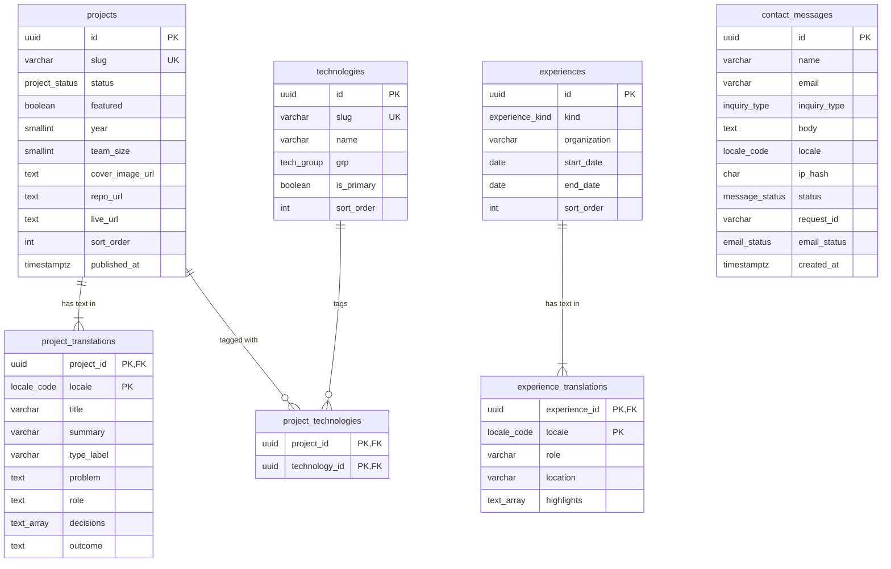

# Database Schema

> Stage 2 · Detailed design · v0.1 · 2026-10-02
> Inputs: Domain model (ENT-*), `openapi.yaml`, ADR-004 (PostgreSQL + Prisma). Feeds: Prisma schema, migrations, seed script.

The database holds 8 tables in PostgreSQL: 6 for the Showcase context and 2 for Contact, with no foreign keys between the two contexts. Localized text lives in translation tables, so adding a third language later is new rows, not new columns.

---

## 1. Design decisions

| Decision | Why |
|---|---|
| Translation tables (`*_translations`) instead of `title_en` / `title_ar` columns | Normalized; a new locale needs no migration; a missing Arabic row falls back to English cleanly. |
| UUID primary keys (`gen_random_uuid()`) | IDs don't leak row counts; safe to expose (e.g. the contact `id`). |
| PostgreSQL enums for closed sets | The database rejects invalid values, matching the API enums one to one. |
| Rate limiting counted from `contact_messages` by `ip_hash` | Single API instance on a free tier: no Redis to run or pay for (NFR-10). Revisit if traffic grows. |
| Profile and blog posts are **not** in the database | Profile is one record in a content file; posts are MDX in the repo (ADR-002). |
| `created_at` / `updated_at` on every table, `timestamptz` | Audit trail; time zones never ambiguous. |
| Hard delete only for messages past retention | Showcase rows are managed by seed; no soft-delete complexity in v1. |

## 2. Entity-relationship diagram

`contact_messages` stands alone: the Contact context shares no tables with Showcase.

## 3. Enums

| Enum | Values | Matches API schema |
|---|---|---|
| `locale_code` | `en`, `ar` | `Locale` |
| `project_status` | `draft`, `published` | (drafts never returned) |
| `tech_group` | `backend`, `databases`, `architecture`, `frontend`, `other_languages`, `systems`, `devops` | `TechGroup` |
| `experience_kind` | `work`, `education`, `volunteer`, `training` | `ExperienceKind` |
| `inquiry_type` | `job`, `freelance`, `other` | `InquiryType` |
| `message_status` | `new`, `read`, `replied` | internal |
| `email_status` | `pending`, `sent`, `failed` | internal |

## 4. Tables

### 4.1 `projects` (ENT-Project)

| Column | Type | Constraints |
|---|---|---|
| `id` | `uuid` | PK, default `gen_random_uuid()` |
| `slug` | `varchar(80)` | NOT NULL, UNIQUE, CHECK matches `^[a-z0-9]+(-[a-z0-9]+)*$` |
| `status` | `project_status` | NOT NULL, default `draft` |
| `featured` | `boolean` | NOT NULL, default `false` |
| `year` | `smallint` | CHECK `year BETWEEN 2000 AND 2100` |
| `team_size` | `smallint` | CHECK `team_size >= 1` |
| `cover_image_url` | `text` | nullable |
| `repo_url` | `text` | nullable, CHECK starts with `https://` |
| `live_url` | `text` | nullable, CHECK starts with `https://` |
| `sort_order` | `integer` | NOT NULL, default `0` |
| `published_at` | `timestamptz` | NOT NULL when `status = 'published'` (CHECK) |
| `created_at`, `updated_at` | `timestamptz` | NOT NULL, default `now()` |

### 4.2 `project_translations`

| Column | Type | Constraints |
|---|---|---|
| `project_id` | `uuid` | PK part, FK → `projects.id` ON DELETE CASCADE |
| `locale` | `locale_code` | PK part |
| `title` | `varchar(120)` | NOT NULL |
| `summary` | `varchar(300)` | NOT NULL |
| `type_label` | `varchar(60)` | nullable (e.g. "Graduation project") |
| `problem` | `text` | NOT NULL |
| `role` | `text` | nullable |
| `decisions` | `text[]` | NOT NULL, default `'{}'` |
| `outcome` | `text` | nullable |
| `created_at`, `updated_at` | `timestamptz` | NOT NULL, default `now()` |

**Invariant (domain):** a published project must have an `en` row. Enforced in the application layer (the publish use case and the seed validator), because a cross-table CHECK is not possible in PostgreSQL without triggers.

### 4.3 `technologies` (ENT-Technology)

| Column | Type | Constraints |
|---|---|---|
| `id` | `uuid` | PK |
| `slug` | `varchar(60)` | NOT NULL, UNIQUE |
| `name` | `varchar(60)` | NOT NULL |
| `grp` | `tech_group` | NOT NULL (`group` is a reserved word) |
| `is_primary` | `boolean` | NOT NULL, default `false` |
| `sort_order` | `integer` | NOT NULL, default `0` |
| `created_at`, `updated_at` | `timestamptz` | NOT NULL, default `now()` |

### 4.4 `project_technologies`

| Column | Type | Constraints |
|---|---|---|
| `project_id` | `uuid` | PK part, FK → `projects.id` ON DELETE CASCADE |
| `technology_id` | `uuid` | PK part, FK → `technologies.id` ON DELETE RESTRICT |

`RESTRICT` stops a technology being deleted while a project still uses it.

### 4.5 `experiences` (ENT-Experience)

| Column | Type | Constraints |
|---|---|---|
| `id` | `uuid` | PK |
| `kind` | `experience_kind` | NOT NULL |
| `organization` | `varchar(120)` | NOT NULL |
| `start_date` | `date` | NOT NULL |
| `end_date` | `date` | nullable (ongoing); CHECK `end_date IS NULL OR end_date >= start_date` |
| `sort_order` | `integer` | NOT NULL, default `0` |
| `created_at`, `updated_at` | `timestamptz` | NOT NULL, default `now()` |

### 4.6 `experience_translations`

| Column | Type | Constraints |
|---|---|---|
| `experience_id` | `uuid` | PK part, FK → `experiences.id` ON DELETE CASCADE |
| `locale` | `locale_code` | PK part |
| `role` | `varchar(120)` | NOT NULL |
| `location` | `varchar(120)` | nullable |
| `highlights` | `text[]` | NOT NULL, default `'{}'` |
| `created_at`, `updated_at` | `timestamptz` | NOT NULL, default `now()` |

### 4.7 `contact_messages` (ENT-Message)

| Column | Type | Constraints |
|---|---|---|
| `id` | `uuid` | PK |
| `name` | `varchar(100)` | NOT NULL, CHECK `char_length(name) >= 2` |
| `email` | `varchar(254)` | NOT NULL |
| `inquiry_type` | `inquiry_type` | NOT NULL |
| `body` | `text` | NOT NULL, CHECK `char_length(body) BETWEEN 10 AND 2000` |
| `locale` | `locale_code` | NOT NULL |
| `ip_hash` | `char(64)` | NOT NULL — SHA-256 of IP + secret salt; raw IP never stored (NFR-7) |
| `status` | `message_status` | NOT NULL, default `new` |
| `request_id` | `varchar(40)` | NOT NULL — links the row to its log line (FR-6.3) |
| `email_status` | `email_status` | NOT NULL, default `pending` |
| `email_attempts` | `smallint` | NOT NULL, default `0` |
| `created_at`, `updated_at` | `timestamptz` | NOT NULL, default `now()` |

**Invariant (domain):** a message is immutable after creation except `status`, `email_status` and `email_attempts`. The repository exposes no update for other columns.

## 5. Indexes

| Index | On | Serves |
|---|---|---|
| `projects_slug_key` (unique) | `projects(slug)` | API-04 lookup by slug |
| `projects_published_idx` | `projects(sort_order, published_at DESC) WHERE status = 'published'` | API-03 list |
| `projects_featured_idx` | `projects(sort_order) WHERE status = 'published' AND featured` | API-03 `featured=true` |
| `project_technologies_tech_idx` | `project_technologies(technology_id)` | API-03 `tag=` filter |
| `technologies_grp_idx` | `technologies(grp, sort_order)` | API-05 |
| `experiences_order_idx` | `experiences(start_date DESC)` | API-06 |
| `contact_messages_rate_idx` | `contact_messages(ip_hash, created_at DESC)` | Rate-limit count (5 per hour) |
| `contact_messages_inbox_idx` | `contact_messages(status, created_at DESC)` | Owner inbox (v2) |
| `contact_messages_email_retry_idx` | `contact_messages(email_status) WHERE email_status <> 'sent'` | Email retry job |

All list queries are index-backed, which supports the API p95 < 300 ms target (NFR-2).

## 6. Data lifecycle

| Data | Created by | Changed by | Removed |
|---|---|---|---|
| Projects, technologies, experiences | Seed script from `content/*.json` | Re-running the seed (upsert by slug) | Seed removes rows missing from content |
| Contact messages | `POST /contact` | Status changes only | **Proposed:** deleted after 12 months by a scheduled job (privacy, NFR-7) — needs owner approval |

## 7. Migrations and seed

- **Tool:** Prisma Migrate. Every schema change is a versioned migration file committed with the code that needs it.
- **Never edit an applied migration.** Fix forward with a new one.
- **Seed:** `pnpm db:seed` reads `content/technologies.json`, `content/experience.json` and `content/projects/*.json`, validates them against the same Zod schemas the API uses, then upserts by slug in one transaction. Invalid content fails the build in CI.
- **Database roles:** the API connects as `portfolio_app` with SELECT on showcase tables and SELECT, INSERT, UPDATE on `contact_messages` only. Migrations run as a separate owner role (NFR-6, least privilege).
- **Local:** Docker Compose starts PostgreSQL 16; `pnpm db:reset` drops, migrates and seeds.

## 8. Domain model coverage (Stage 2 gate)

| Entity | Stored in |
|---|---|
| ENT-Project | `projects` + `project_translations` + `project_technologies` |
| ENT-Technology | `technologies` |
| ENT-Experience | `experiences` + `experience_translations` |
| ENT-Message | `contact_messages` |
| ENT-Profile | `content/profile.json` (by design, not a table) |
| ENT-Post | `content/blog/*.mdx` (by design, not a table) |

Result: 6 of 6 entities have a home.

## 9. Open item

- **Message retention period:** 12 months proposed. Confirm or choose another period.
